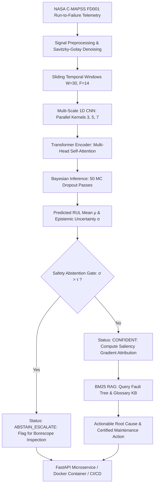

# 🏭 Predictive Maintenance RUL OpsCopilot (MLOps Edition)

[](https://github.com/debanjan-steel/RUL-Production-Copilot)
[](https://www.python.org/)
[](https://fastapi.tiangolo.com/)
[](https://www.docker.com/)

An end-to-end, production-grade MLOps system for Remaining Useful Life (RUL) estimation of turbofan aircraft engines across the entire **NASA C-MAPSS benchmark suite (FD001, FD002, FD003, FD004)**. 

Unlike standard offline research notebooks, this platform packages a hybrid **Multi-Scale CNN-Transformer** inside an agentic, uncertainty-aware **OpsCopilot** and serves it via an asynchronous **FastAPI** REST microservice.

---

## 🏗️ Architecture & Data Flow



---

## 🚀 Key Engineering & Machine Learning Features

* **Multi-Scale 1D Convolutions:** Parallel temporal kernels ($k=3, 5, 7$) extract both high-frequency sensor measurement jitter and broader baseline thermodynamic shifts.
* **Global Self-Attention:** Transformer encoder captures long-term degradation dependencies across engine cycles without the vanishing gradients or sequential bottlenecks of LSTMs.
* **Physics-Informed Monotonic Loss:** Penalizes non-monotonic wear increases ($\Delta \text{RUL} > 0$), reflecting the irreversible physical wear of turbofan rotating assemblies.
* **Bayesian Uncertainty Quantification (UQ):** Active Monte Carlo Dropout ($N=50$ stochastic passes) produces 95% Bayesian credible intervals for every prediction.
* **Safety Abstention Gate:** The model refuses automated clearance if epistemic uncertainty $\sigma$ exceeds the safety threshold ($\tau=18.0$ cycles), escalating to human maintenance personnel.
* **Feature Attribution Saliency:** Real-time input gradient backpropagation ranks the top sensor drivers behind the degradation signature.
* **Domain Grounded Copilot (RAG):** BM25 lexical ranker searches verified engineering manuals (`kb/fault_tree.md` and `kb/glossary.md`) to generate cited, hallucination-free maintenance protocols.
* **Production Serving & Testing:** Asynchronous FastAPI service with Pydantic V2 validation, health probes, automated `pytest` test suite, and GitHub Actions CI/CD.

---

## 📂 Repository Layout

```
rul-production-copilot/
├── api/
│   ├── main.py                 # FastAPI microservice & routing
│   └── schemas.py              # Pydantic v2 validation models
├── src/
│   ├── models/
│   │   ├── __init__.py
│   │   └── cnn_transformer.py  # Multi-Scale CNN-Transformer + MC Dropout + Physics Loss
│   ├── copilot/
│   │   ├── __init__.py
│   │   ├── retriever.py        # BM25 knowledge base search
│   │   └── agent.py            # Safety abstention gate & saliency attribution
│   ├── data_loader.py          # NASA C-MAPSS dataset parser & generator
│   ├── preprocess.py           # Savitzky-Golay filtering & sliding window generator
│   └── train.py                # Unified MLflow training loop with NASA scoring
├── kb/
│   ├── fault_tree.md           # Engineering failure modes & root cause protocols
│   └── glossary.md             # Sensor telemetry descriptions & component map
├── tests/
│   ├── test_model.py           # Unit tests for model architecture & preprocessing
│   └── test_api.py             # Integration tests for FastAPI endpoints
├── .github/workflows/
│   └── build-and-test.yml      # CI/CD pipeline (Test & Docker build)
├── Dockerfile                  # Containerization specification
├── requirements.txt            # Pinned production dependencies
└── README.md                   # System documentation
```

---

## 🛠️ Quickstart

### 1. Clone & Set Up Local Environment
```bash
git clone https://github.com/YourUsername/rul-production-copilot.git
cd rul-production-copilot

# Create virtual environment
python -m venv venv
source venv/bin/activate  # On Windows: venv\Scripts\activate

# Install dependencies
pip install -r requirements.txt
```

### 2. Run the Automated Test Suite
```bash
pytest tests/ -v
```

### 3. Launch the FastAPI Serving Endpoint
```bash
uvicorn api.main:app --host 0.0.0.0 --port 8000 --reload
```
Navigate to `http://localhost:8000/docs` to test endpoints via the interactive Swagger UI.

### 4. Run via Docker
```bash
# Build the container
docker build -t rul-copilot:latest .

# Run the containerized service
docker run -p 8000:8000 rul-copilot:latest
```

---

## 📡 Sample API Request & Response

### Request (`POST /predict`):
```json
{
  "engine_id": 14,
  "cycle": 115,
  "sensor_readings": [
    642.5, 1588.0, 1405.0, 553.0, 2388.0, 9050.0,
    47.5, 521.0, 2388.0, 8130.0, 8.4, 392.0, 38.8, 23.3
  ],
  "mc_samples": 50
}
```

### Response (`200 OK`):
```json
{
  "engine_id": 14,
  "cycle": 115,
  "predicted_rul": 44.82,
  "uncertainty_std": 5.12,
  "confidence_interval_95": [34.78, 54.86],
  "status": "CONFIDENT",
  "confidence_level": "HIGH",
  "recommendation": "Urgency: WARNING (P2). Schedule maintenance within 44 operating cycles. Degradation signature driven primarily by sensors s3, s4, s2. Recommended Action: Schedule immediate borescope inspection of HPC stages 5 through 9 for blade erosion and deposit accumulation.",
  "top_degrading_sensors": [
    {"sensor": "s3", "importance": 0.382},
    {"sensor": "s4", "importance": 0.291},
    {"sensor": "s2", "importance": 0.185}
  ],
  "citations": [
    "High Pressure Compressor (HPC) Degradation & Fouling",
    "High Pressure Turbine (HPT) Thermal Distress & Blade Erosion"
  ]
}
```

---

## 📊 Scientific & Benchmark References
* **NASA C-MAPSS Benchmark:** A. Saxena, K. Goebel, D. Simon, and N. Eklund, *"Damage Propagation Modeling for Aircraft Engine Run-to-Failure Simulation"*, IEEE PHM, 2008.
* **Paper A:** Enhanced Savitzky-Golay + Deep Learning Framework for Turbofan RUL, *Scientific Reports*, 2024.
* **Paper B:** Bayesian Uncertainty Quantification and RUL Prediction Using Deep Learning, *IJSIMM*, 2025.